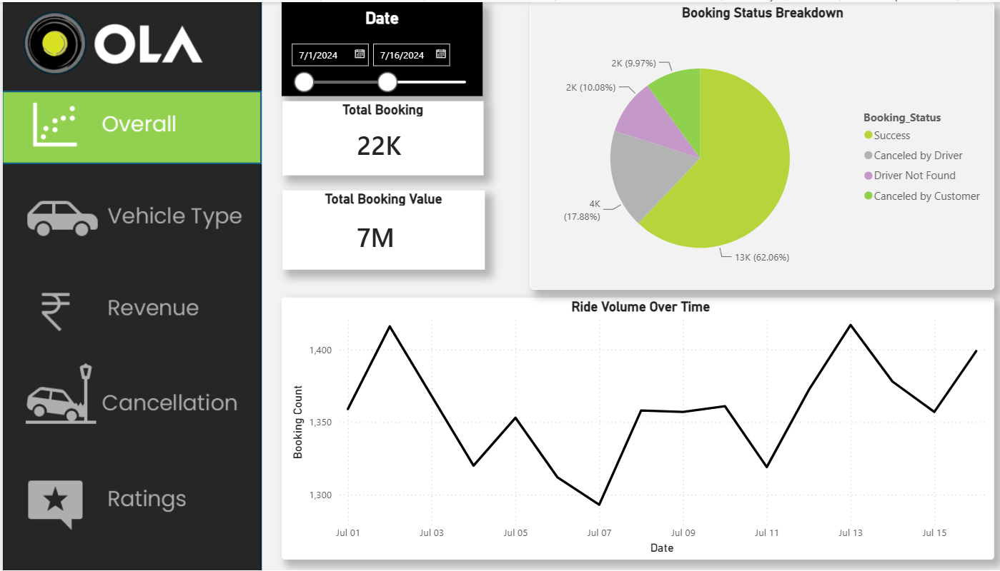
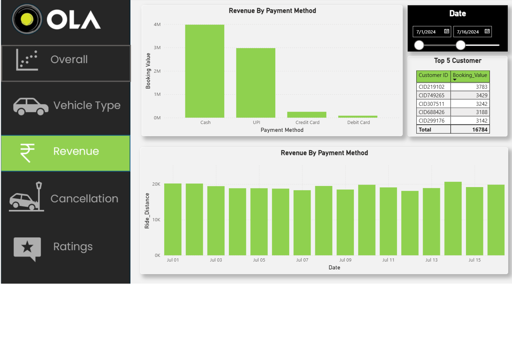
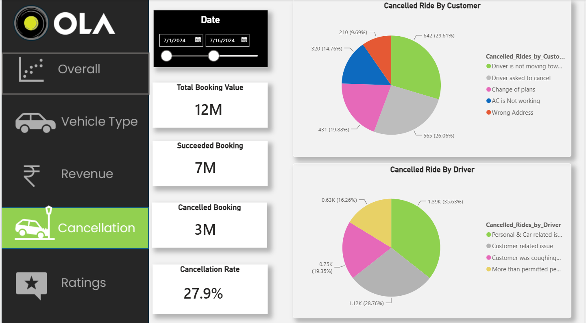
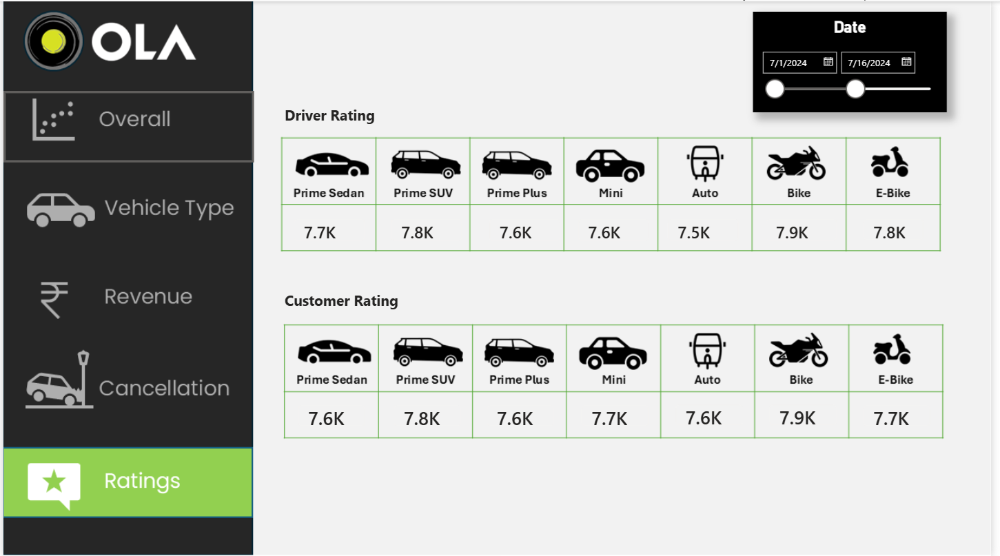

# Ola Booking Analysis Dashboard

## About the Project

This project is an interactive Power BI dashboard created to analyze Ola booking data.

The dashboard provides insights into booking performance, revenue, vehicle types, cancellations, ride distance, and driver ratings.

## Tools Used

- Power BI
- SQL / MySQL
- DAX
- Power Query
- Microsoft Excel

## Dashboard Pages

### Overall
Provides an overview of the main booking and revenue metrics.

### Vehicle Type
Shows booking value, successful booking value, average distance, and total distance for different vehicle types.

### Revenue
Analyzes booking value and distance travelled across different vehicle types.

### Cancellation
Shows customer and driver cancellation reasons along with cancellation-related KPIs.

### Ratings
Shows driver rating information for different vehicle types.

## Key Metrics

- Total Booking Value
- Successful Booking Value
- Cancelled Bookings
- Cancellation Rate
- Total Distance Travelled
- Average Distance Travelled
- Driver Ratings
- Vehicle Type Performance

## Dataset

The project uses a publicly shareable Ola booking dataset.

The dataset includes information such as:

- Booking status
- Vehicle type
- Booking value
- Ride distance
- Driver ratings
- Customer ratings
- Customer cancellation reasons
- Driver cancellation reasons
- Payment method
- Pickup and drop locations

The dataset is available in the `dataset` folder.

## Dashboard Screenshots

### Overall

### Vehicle Type

### Revenue

### Cancellation

### Ratings

## Project Files

- `Ola_Booking_Analysis_PowerBI.pbix` - Power BI dashboard
- `dataset/` - Dataset used for the project
- `screenshots/` - Dashboard screenshots

## Author

Siddheshwar Ghadage

Computer Engineering Student  
Nutan Maharashtra Institute of Engineering and Technology (NMIET)
